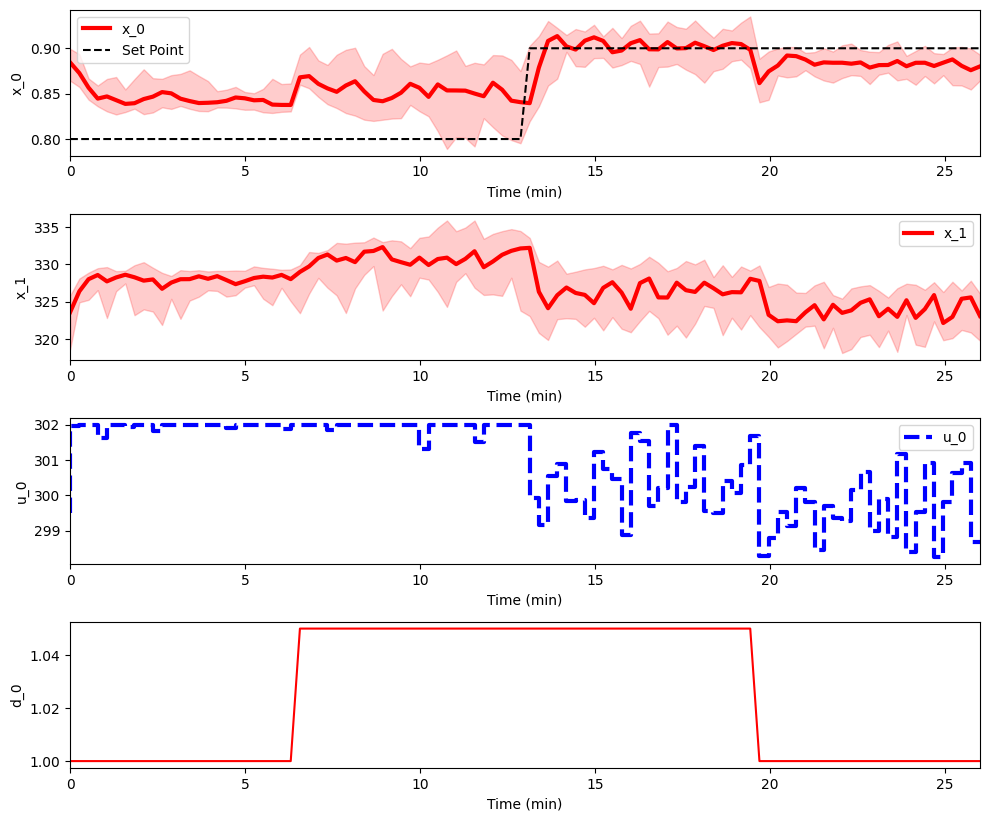

This is a user guide for the disturbance function in the pc-gym which will walkthrough how to add a custom disturbance to the environment.

### Disturbance Definition

In this example we have already set up an environment according to the `Training` user guide. Hence we will update the environment definition with an additional disturbance input to the inlet concentration of species A. This disturbances are defined in a dictionary named `disturbance`. The keys in the dictionary represent the state, and the values are numpy arrays that represent the disturbance for each step in the state. 

**Note:** All disturbances variable must be defined. Please use `None` for default values of the disturbance variable. For example, in the code snippet, the inlet temperature disturbance is defined as `None` to set it to its default value. 

```py
# Define disturbance dictionary
disturbance = {
    '0': np.array([None for i in range(nsteps)]),
    '1': np.array([1 for i in range(int(nsteps/2))]+[1.05 for i in range(int(nsteps))])
    }
    
env_params.update({'disturbances': disturbance}) # Update environment definition
env = Models_env(env_params) # Create a new instance of the environment with the disturbance
```

### Training with a Disturbance Example
A policy is now trained on the environment with a disturbance. We use the <a href ="https://arxiv.org/abs/1707.06347"> Proximal Policy Optimization (PPO)</a> algorithm implemented by <a href="https://stable-baselines3.readthedocs.io/en/master/#">Stable Baselines 3</a>.
```py
disturbance_policy = PPO('MlpPolicy', env, verbose=1,learning_rate=0.01).learn(total_timesteps=3e4)
env.plot_rollout(disturbance_policy,10)   
```
<figure>
  
</figure>