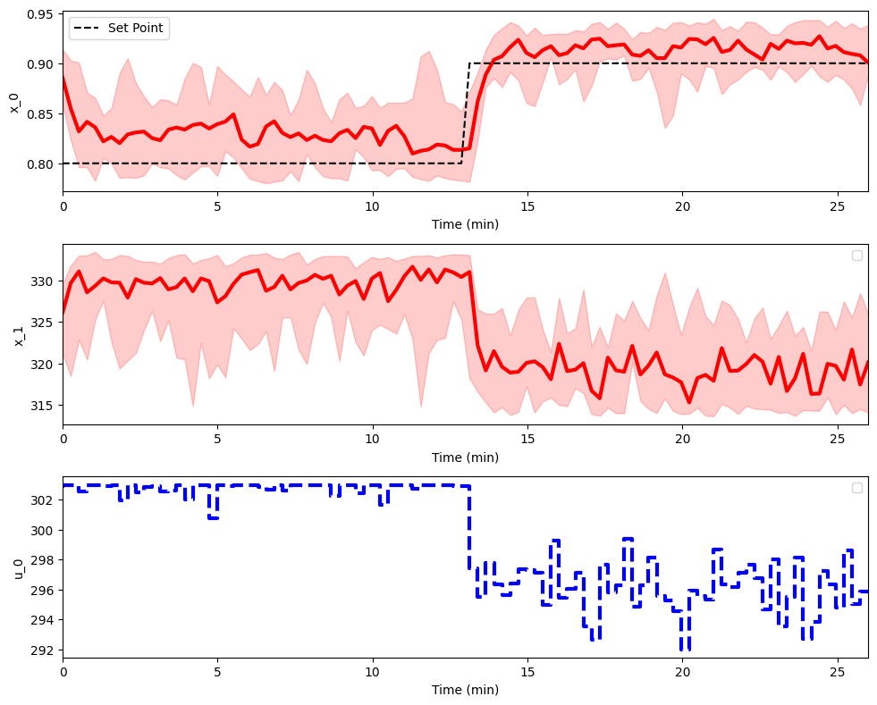

This is a user guide to setup a training algorithm using the pc-gym environment. We use  <a href="https://stable-baselines3.readthedocs.io/en/master/#">Stable Baselines 3</a> to implement the reinforcement learning algorithm  <a href ="https://arxiv.org/abs/1707.06347"> Proximal Policy Optimization (PPO)</a>.

### Environment Definition
Firstly import the model library and numpy.

```py
from Models import Models_env
import numpy as np 
```
In control systems, a setpoint is the target or goal for a system's output. It's the value that the control system aims to achieve.

In this code snippet, a dictionary named `SP` is created to store the setpoints for each state. The keys in the dictionary represent the state (concentration of species A), and the values are lists that represent the setpoints for each step in the state.
```py
#Enter required setpoints for each state. Enter None for states without setpoints.
SP = {'0': [0.8 for i in range(int(nsteps/2))] + [0.9 for i in range(int(nsteps/2))]}

```
In reinforcement learning, the `action_space` and `observation_space` are two important concepts that define the range of possible actions that an agent can take and the range of possible observations that an agent can perceive, respectively.

In this code snippet, both the `action_space` and `observation_space` are defined as continuous spaces, represented by a dictionary with 'low' and 'high' keys. 
```py
#Continuous box action space
action_space = {
    'low': np.array([295]),
    'high':np.array([302]) 
}
#Continuous box observation space
observation_space = {
    'low' : np.array([0.7,300,0.8]), # [Ca,T,Ca_SP]
    'high' : np.array([1,350,0.9])  
}
```

In this code snippet, a dictionary named `env_params` is created to store the parameters of the environment. An instance of the `Models_env` OpenAI gym class is created with the parameters defined in the `env_params` dictionary.

```py
env_params = {
    'Nx': 2, # Number of states
    'N': nsteps, # Number of time steps
    'tsim':T, # Simulation Time
    'Nu':1, # Number of control/actions
    'SP':SP, #Setpoint
    'o_space' : observation_space, #Observation space
    'a_space' : action_space, # Action space
    'dt': 1., # Time step
    'x0': np.array([0.8,330,0.8]), # Initial conditions. Include setpoint!
    'model': 'cstr_ode', #Select the model
    'r_scale': {'0': 5}, #Scale the L1 norm used for reward (|x-x_sp|*r_scale)
    'normalise': True, #Normalise the states 
}
env = Models_env(env_params)
```

### Policy Training
Next the policy can be trained using the previously defined environment and the PPO algorithm from stable baselines 3.
```py
from stable_baselines3 import PPO
nsteps = 3e4
policy = PPO('MlpPolicy', env, verbose=1,learning_rate=0.01).learn(nsteps)
```

### Policy Rollout and Plotting
With the trained policy, the `rollout` method can be called to rollout and plot the resulting state and control values.

```py 
repitions = 10
env.plot_rollout(initial_policy,repitions)
```


<figure>
  
</figure>
