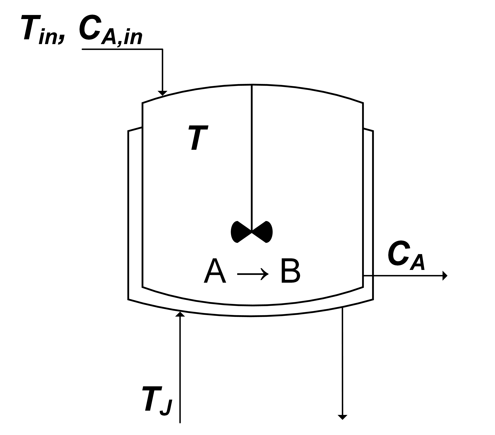

<script type="text/javascript"
  src="https://cdnjs.cloudflare.com/ajax/libs/mathjax/2.7.0/MathJax.js?config=TeX-AMS_CHTML">
</script>
<script type="text/x-mathjax-config">
  MathJax.Hub.Config({
    tex2jax: {
      inlineMath: [['$','$'], ['\\(','\\)']],
      processEscapes: true},
      jax: ["input/TeX","input/MathML","input/AsciiMath","output/CommonHTML"],
      extensions: ["tex2jax.js","mml2jax.js","asciimath2jax.js","MathMenu.js","MathZoom.js","AssistiveMML.js", "[Contrib]/a11y/accessibility-menu.js"],
      TeX: {
      extensions: ["AMSmath.js","AMSsymbols.js","noErrors.js","noUndefined.js"],
      equationNumbers: {
      autoNumber: "AMS"
      }
    }
  });
</script>
<div style="display: flex; justify-content: center;">
  
</div>
 

## Description & Equations
The continuously stirred tank reactor (CSTR) is a system which converts species A to species B via the reaction: A  →  B. The reactor's temperature is controlled by a cooling jacket. The following system of equations describes the system:


\begin{align}
  \nonumber\frac{\mathrm{d}C_A}{\mathrm{d}t} &= \frac{q}{V}(C_{A_f} - C_A) - kC_Ae^{\frac{-E_A}{RT}}\\
\end{align}
\begin{align}
  \nonumber\frac{\mathrm{d}T}{\mathrm{d}t} &= \frac{q}{V}(T_f - T) -\frac{\Delta H_R}{\rho C_p}kC_Ae^{\frac{-E_A}{RT}} + \frac{UA}{\rho C_p V}(T_c - T)
\end{align}
where $C_A$, the concentration of species A in the reactor, and $T$, the temperature of the reactor, are the state variables, $\mathbf{x} = [C_A, T]^\intercal \in \mathbb{R}^2$ while, $u = T_c$, the cooling water temperature, is the action variable.

## Observation
The observation of the `CSTR` environment provides information on the state variables and their associated setpoints (if they exist) at the current timestep. The observation is an array of shape `(1, 2 + N_SP)` where `N_SP` is the number of setpoints. Therefore, the observation when there exist a setpoint for both states is
``[CA, T, CA_Setpoint, T_Setpoint]``.

The observation space is defined by the following bounds corresponding to the ordered state variables:
```
[[0.7,1],[300,350],[0.8,0.9]]
```
An example, tested set of initial conditions are as follows:
```
[0.8,330,0.8]
```

## Action
The action space is a `ContinuousBox` of `[290,302]` which corresponds to a jacket temperature between 290 K and 302 K.

## Reward

The reward is a continuous value corresponding to square error of the state and its setpoint. For multiple states, these are scaled with a factor (`r_scale`) and summed to give a single value.

## Reference

This model implementation and its description were kindly provided by [Akhil Ahmed](https://scholar.google.com/citations?user=AS34x7cAAAAJ). The original model was created by by [Hedengren (2022)](https://apmonitor.com/pdc/index.php/Main/StirredReactor).