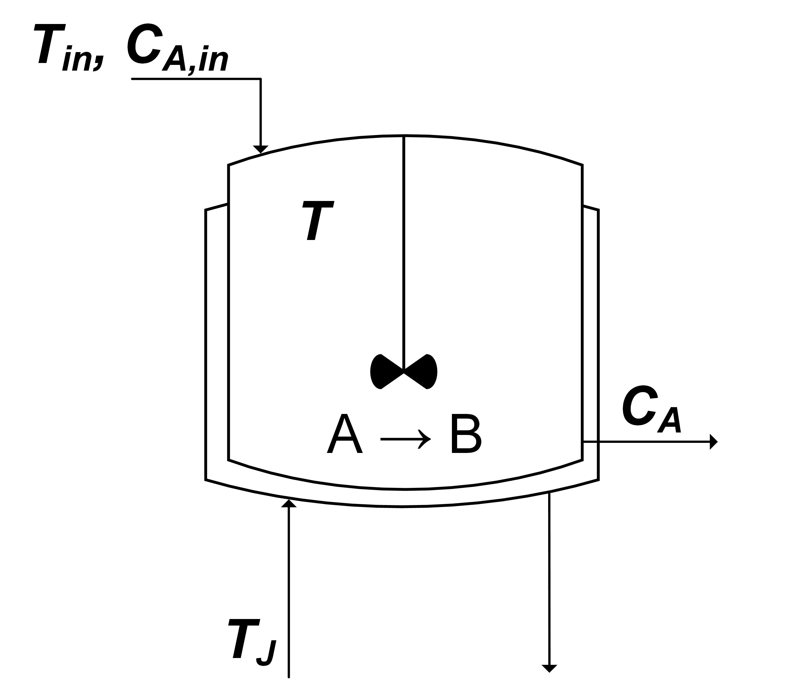

  

 
# Photo Production of Phycocyanin

## Description & Equations
A model describing the photo production of phycocyanin from Cyanobacteria Arthrospira platensis. The system is described by three state variables representing biomass concentration ($c_x$), nitrate concentration ($c_N$), and phycocyanin concentration ($c_q$).

The system dynamics are governed by the following equations:

$$
\frac{dc_x}{dt} = \frac{\mu_m I}{I + k_s + \frac{I^2}{k_i}} \cdot \frac{c_x c_N}{c_N + k_N} - \mu_d c_x
$$

$$
\frac{dc_N}{dt} = -Y_{NX} \frac{\mu_m I}{I + k_s + \frac{I^2}{k_i}} \cdot \frac{c_x c_N}{c_N + k_N} + F_N
$$

$$
\frac{dc_q}{dt} = \frac{k_m I}{I + k_{sq} + \frac{I^2}{k_{iq}}} c_x - \frac{k_d c_q}{c_N + K_{Nq}}
$$

where $\mathbf{x} = [c_x, c_N, c_q]^\intercal \in \mathbb{R}^3$ represents the state vector and $\mathbf{u} = [I, F_N]^\intercal$ represents the input vector consisting of light intensity ($I$) and nitrate feed rate ($F_N$).
## Initial Conditions
The initial conditions for the state variables are defined as follows:
- $\mathbf{x_0} = [0.1, 20.0, 0.01]$: Initial state vector representing the initial concentrations of biomass, nitrate, and phycocyanin, respectively.
## Model Parameters
The model includes the following parameters:
- $\mu_m = 0.0572$: Maximum specific growth rate
- $\mu_d = 0.0$: Death rate
- $Y_{NX} = 504.5$: Yield coefficient
- $k_m = 0.00016$: Product formation rate
- $k_d = 0.281$: Product degradation rate
- $k_{sq} = 23.51$: Light saturation constant for product formation
- $K_{Nq} = 16.89$: Nitrate saturation constant for product degradation
- $k_{iq} = 800.0$: Light inhibition constant for product formation

## States
The model has three states:
- $c_x$: Biomass concentration
- $c_N$: Nitrate concentration
- $c_q$: Phycocyanin concentration

## Inputs
The system has two control inputs:
- $I$: Light intensity
- $F_N$: Nitrate feed rate

## Reference
This model implementation and its description were kindly provided by [Mathew Marsh](https://www.linkedin.com/in/matthew--marsh/?originalSubdomain=uk). The original model was created by [Bradford et. al. (2020)](https://www.sciencedirect.com/science/article/pii/S0098135419313080). 