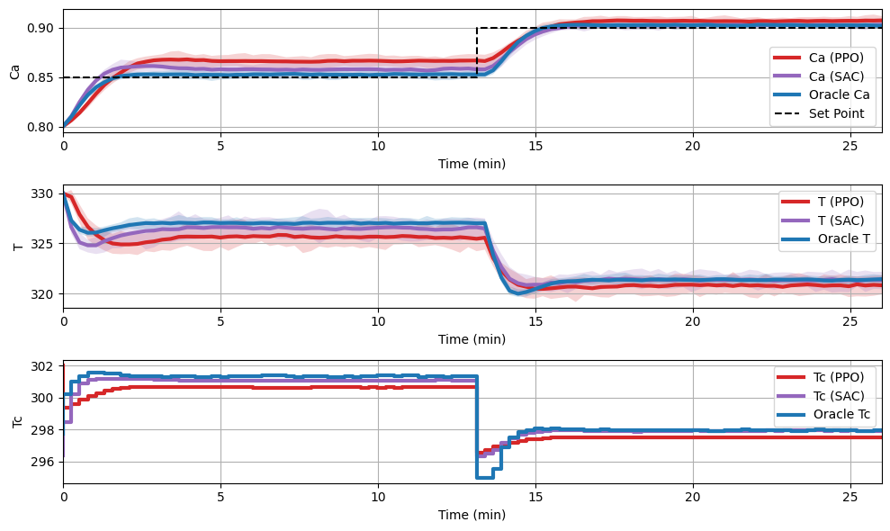
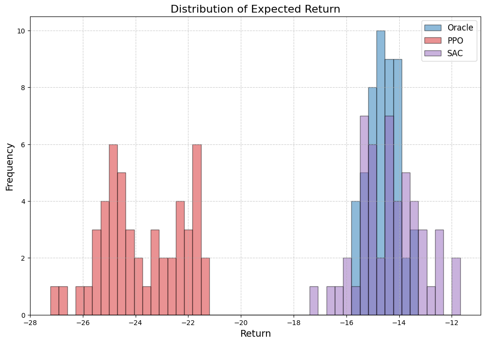

<script type="text/javascript"
  src="https://cdnjs.cloudflare.com/ajax/libs/mathjax/2.7.0/MathJax.js?config=TeX-AMS_CHTML">
</script>
<script type="text/x-mathjax-config">
  MathJax.Hub.Config({
    tex2jax: {
      inlineMath: [['$','$'], ['\\(','\\)']],
      processEscapes: true},
      jax: ["input/TeX","input/MathML","input/AsciiMath","output/CommonHTML"],
      extensions: ["tex2jax.js","mml2jax.js","asciimath2jax.js","MathMenu.js","MathZoom.js","AssistiveMML.js", "[Contrib]/a11y/accessibility-menu.js"],
      TeX: {
      extensions: ["AMSmath.js","AMSsymbols.js","noErrors.js","noUndefined.js"],
      equationNumbers: {
      autoNumber: "AMS"
      }
    }
  });
</script>
This is a user guide for the policy evaluation tool in pc-gym which will walkthrough an example of how to use the policy evaluation tools available in `pc-gym`


### Plot Rollout 
The following code shows the policy and oracle comparison capability. The oracle is defined as a NMPC with perfect model (oracle uses ocp with control cost which differs from the reward function used by the RL agent) and can be sensitive to tuning of the horizon and control cost. 

```py
policies = {'PPO': PPO_policy,'SAC':SAC_policy} # Dictionary of policies to compare
evaluator,data = env.plot_rollout(policies, reps = 10, oracle=True, dist_reward=True, MPC_params={'N':15,'R':5})
```
<figure>
  
</figure>

### Reward Distribution and Reproducibility Metric
A visualisation of the reward distribution can also be shown using `dist_reward`.
<figure>
  
</figure>

The `pc-gym` can also calculate dispersion and performance metrics of the distribution of rewards to allow the user to evaluate their policy. This anaylsis follows the evaluation metric used by [Manon Flageat et al (2024)](https://arxiv.org/pdf/2312.07178.pdf). First an instance of the `reproducibility_metric` class is created with the user-selected metrics for both performance and dispersion:
```py
policy_measure = reproducibility_metric(dispersion='mad', performance='mean', scalarised_weight=2e3)
```
Then the `policy_dispersion_metric` method can be called to return a dictionary of the dispersion metrics:
```py
policy_measure.policy_dispersion_metric(data, component='r')
# which returns:
#{'oracle': {'r': array([0.38975316])},
# 'PPO': {'r': array([1.18513328])},
# 'SAC': {'r': array([0.83717672])}}
```
Then the `policy_performance_metric` and po method can be called to return a dictionary of the performance metrics:
```py
policy_measure.policy_performance_metric(data, component='r')
# which returns:
#{'oracle': {'r': array([-14.58502467])},
# 'PPO': {'r': array([-23.76918418])},
# 'SAC': {'r': array([-14.33262298])}}
```