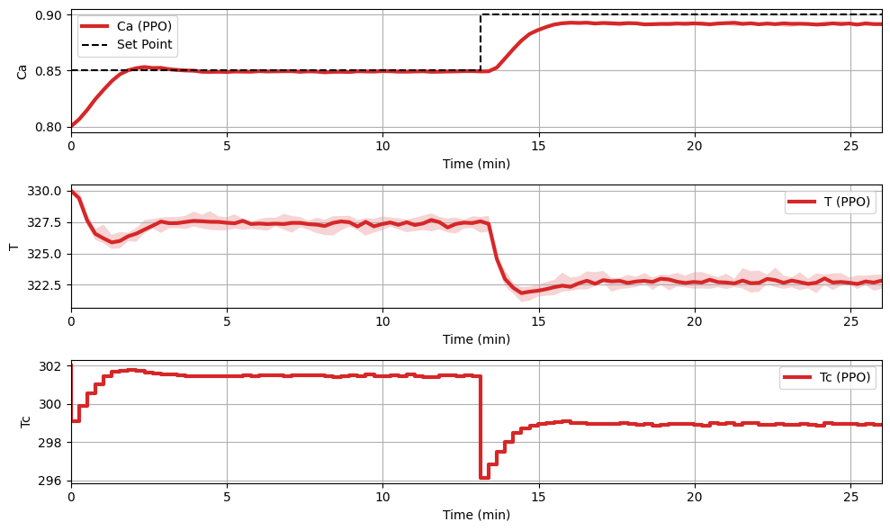

<script type="text/javascript"
  src="https://cdnjs.cloudflare.com/ajax/libs/mathjax/2.7.0/MathJax.js?config=TeX-AMS_CHTML">
</script>
<script type="text/x-mathjax-config">
  MathJax.Hub.Config({
    tex2jax: {
      inlineMath: [['$','$'], ['\\(','\\)']],
      processEscapes: true},
      jax: ["input/TeX","input/MathML","input/AsciiMath","output/CommonHTML"],
      extensions: ["tex2jax.js","mml2jax.js","asciimath2jax.js","MathMenu.js","MathZoom.js","AssistiveMML.js", "[Contrib]/a11y/accessibility-menu.js"],
      TeX: {
      extensions: ["AMSmath.js","AMSsymbols.js","noErrors.js","noUndefined.js"],
      equationNumbers: {
      autoNumber: "AMS"
      }
    }
  });
</script>
# Adding Constraints in PC-Gym

This guide explains how to add and work with constraints in the PC-Gym environment using a practical example.

## Understanding Constraints

In PC-Gym, constraints are used to enforce limits on system states. For example, we may want to ensure a temperature stays within certain bounds during operation.

Constraints are defined using two key components:
- A dictionary mapping states to their constraint values 
- A dictionary specifying the types of constraints (e.g. greater than, less than)

## Step-by-Step Implementation

### 1. Define the Constraints

First, we define constraints on the temperature T to stay between 319K and 331K. In pc-gym, we use a lambda function to define constraints and always define constraints as $$g(x,u) \leq 0$$.

```python
cons = lambda x, u: np.array([319 - x[1], x[1] - 331]).reshape(-1,)
```

### 2. Configure Environment Parameters 

Next, we update the environment parameters with the constraint settings:

```python
env_params = {
    # ... other parameters ...
    'done_on_cons_vio': False,  # Episode continues even if constraint violated
    'constraints': cons,        # Our defined constraints
    'r_penalty': True          # Add reward penalty for constraint violations
}

# Create environment with constraints
env = make_env(env_params)
```

The key parameters are:
- `done_on_cons_vio`: Controls whether episodes end when constraints are violated
- `constraints`: The constraint function we defined
- `r_penalty`: Enables reward penalties for constraint violations 

### 3. Training with Constraints

We can now train a policy that respects these constraints using reinforcement learning. Here's an example using PPO:

```python
# Train constrained policy
PPO_policy = PPO('MlpPolicy', env, verbose=1, learning_rate=0.001).learn(nsteps_learning)

# Visualize results
evaluator, data = env.plot_rollout({'PPO': PPO_policy}, reps=10, cons_viol=False)
```

### Training with a Constraint Example 

A policy is now trained on the environment with a constraint. We use the <a href ="https://arxiv.org/abs/1707.06347"> Proximal Policy Optimization (PPO)</a> algorithm implemented by <a href="https://stable-baselines3.readthedocs.io/en/master/#">Stable Baselines 3</a>. We can now rollout and plot the policy. Note the constraints on the temperature plot. The `cons_viol` input can be used to display the constraint violations. Try reducing the number of timesteps used to train the policy or tightening the constraints and turning on the constraint violation visulisation!
```py
constraint_policy = PPO('MlpPolicy', env, verbose=1,learning_rate=0.01).learn(total_timesteps=3e4)
evaluator, data = env.plot_rollout(constraint_policy, reps = 10, cons_viol = False)   
```
<figure>
  
  
</figure>
