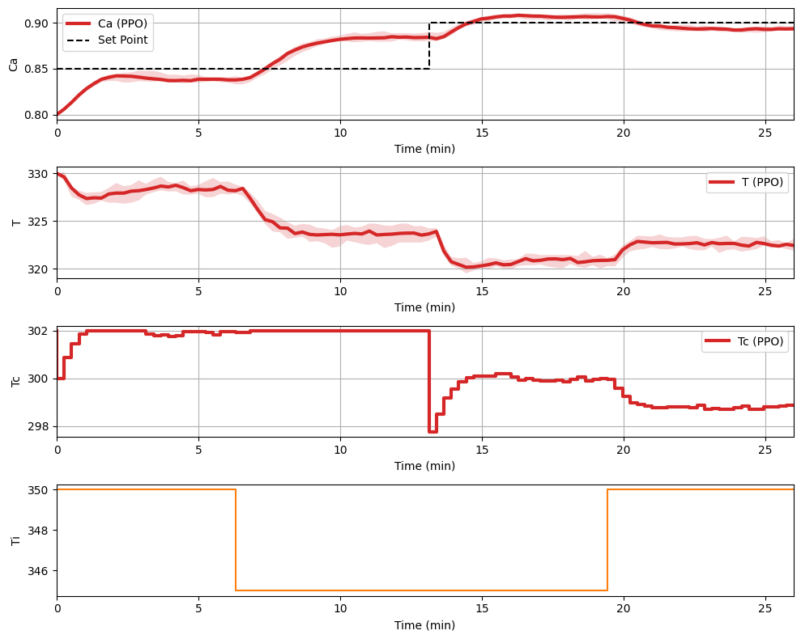

This is a user guide for the disturbance function in the pc-gym which will walkthrough how to add a custom disturbance to the environment.

### Disturbance Definition

In this example we have already set up an environment according to the `Training` user guide. Hence we will update the environment definition with an additional disturbance input to the inlet temperature. This disturbances are defined in a dictionary named `disturbance`. The keys in the dictionary represent the state, and the values are numpy arrays that represent the disturbance for each step in the state. 

The disturbances are added to the RL state which requires a space definition hence the disturbance bounds are added to the environment definition. 


```py
# Define disturbance dictionary
disturbance = {'Ti': np.repeat([350, 45, 350], [nsteps//4, nsteps//2, nsteps//4])}
disturbance_space ={
  'low': np.array([320]),
  'high': np.array([350])
}
env = make_env({**env_params,'disturbance_bounds':disturbance_space, 'disturbances': disturbance})
```

### Training with a Disturbance Example
A policy is now trained on the environment with a disturbance. We use the <a href ="https://arxiv.org/abs/1707.06347"> Proximal Policy Optimization (PPO)</a> algorithm implemented by <a href="https://stable-baselines3.readthedocs.io/en/master/#">Stable Baselines 3</a>.
```py
disturbance_policy = PPO('MlpPolicy', env, verbose=1,learning_rate=0.01).learn(total_timesteps=3e4)
env.plot_rollout(disturbance_policy,10)   
```
<figure>
  
</figure>